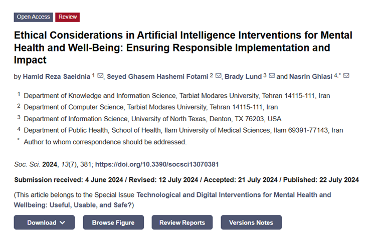

# Audience list

This section contains the contacts of the research community, including
 individuals working at the intersection of ethics, AI, and mental health, as
 well as some NGOs.

"Ethical AI Alliance is a transdisciplinary community committed to setting the
 new standard for justice and inclusion in AI with our Ethical AI Label. We are
  focused on delivering real, impactful change by ensuring technology uplifts
   marginalized voices and actively contributes to a more just and inclusive world."

This article contain 4 contacts, we can found them, here: [Article](https://www.mdpi.com/2076-0760/13/7/381?utm_source=chatgpt.com)

